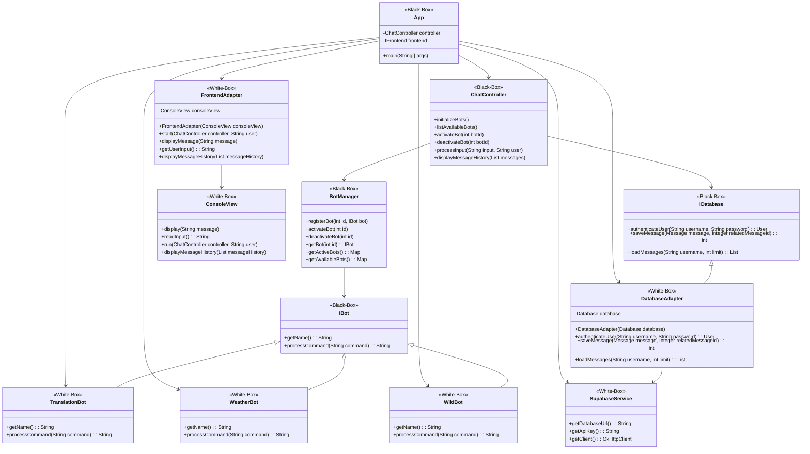

## 1.7 Bausteinschicht

## White-Boxen

### View-Verzeichnis (White-Box)
- **Beschreibung**: Dieses Verzeichnis enthält die Komponenten, die für die Benutzeroberfläche und die Interaktion mit dem Benutzer verantwortlich sind.
- **Enthaltene Black-Boxen**:
  - **ConsoleView.class**: Implementiert die Konsolenanzeige und die Benutzerinteraktion.
  - **FrontendAdapter.class**: Adaptiert die Konsolenansicht für die Verwendung mit dem Frontend-Interface.

### Controller-Verzeichnis (White-Box)
- **Beschreibung**: Dieses Verzeichnis enthält die Steuerungskomponenten des Systems, die zentrale Logikfunktionen koordinieren und die Kommunikation zwischen verschiedenen Systemkomponenten managen.
- **Enthaltene Black-Boxen**:
  - **ChatController.class**: Steuert die Chat-Interaktionen und verwaltet die Kommunikation zwischen Benutzereingaben und Systemreaktionen.

### Persistence-Verzeichnis (White-Box)
- **Beschreibung**: Dieses Verzeichnis enthält Komponenten, die für die Datenpersistenz verantwortlich sind. Dazu gehört die Verwaltung und Speicherung von Daten sowie die Interaktion mit der Datenbank.
- **Enthaltene Black-Boxen**:
  - **Database.class**: Verwaltet die Datenbankoperationen und die Datenpersistenz.
  - **DatabaseAdapter.class**: Adapter für die Datenbank, der die Datenbankoperationen implementiert und an das System anbindet.
  - **SupabaseService.class**: Stellt die Verbindung zur Supabase-Datenbank her.

### Services-Verzeichnis (White-Box)
- **Beschreibung**: Dieses Verzeichnis enthält verschiedene Dienstklassen, die spezifische Funktionen und Schnittstellen für externe APIs und interne Dienste bereitstellen.
- **Enthaltene Black-Boxen**:
  - **CurrentWeatherService.class**: Bietet Wetterdaten von der OpenWeatherMap-API.
  - **WeatherForecastService.class**: Bietet Wettervorhersagedaten von der OpenWeatherMap-API.
  - **WikiService.class**: Stellt Wikipedia-Suchanfragen bereit.
  - **TranslationService.class**: Bietet Textübersetzungsdienste über die DeepL-API.

## Black-Boxen

### Root-Verzeichnis (Black-Box)
- **App.class**: Die Hauptklasse der Anwendung, die als Einstiegspunkt dient. Sie initialisiert das System und startet die Anwendung, ohne dass die internen Abläufe für das Verständnis der Gesamtarchitektur von Bedeutung sind.

# Statische Struktur des Systems

