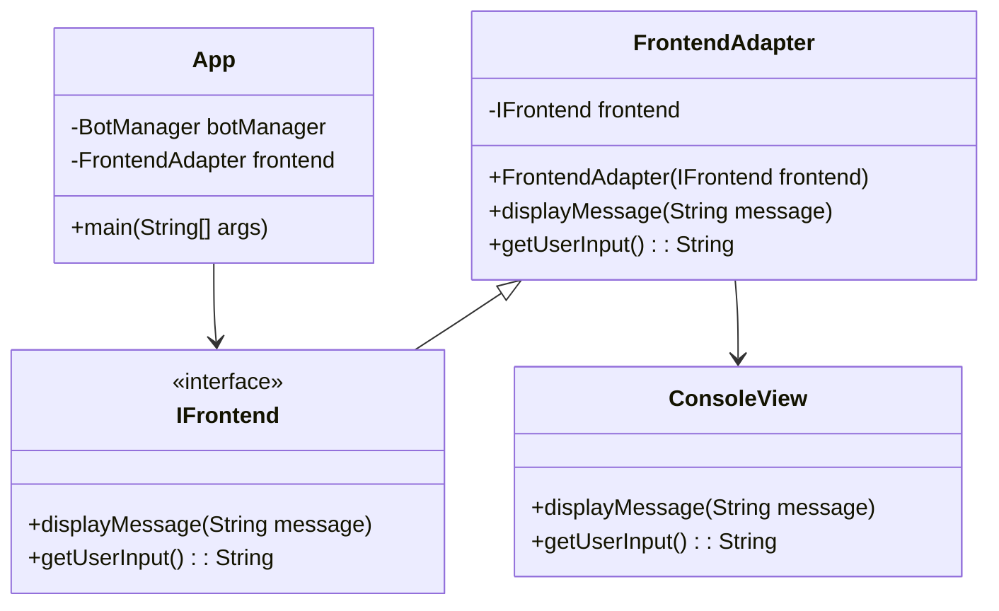
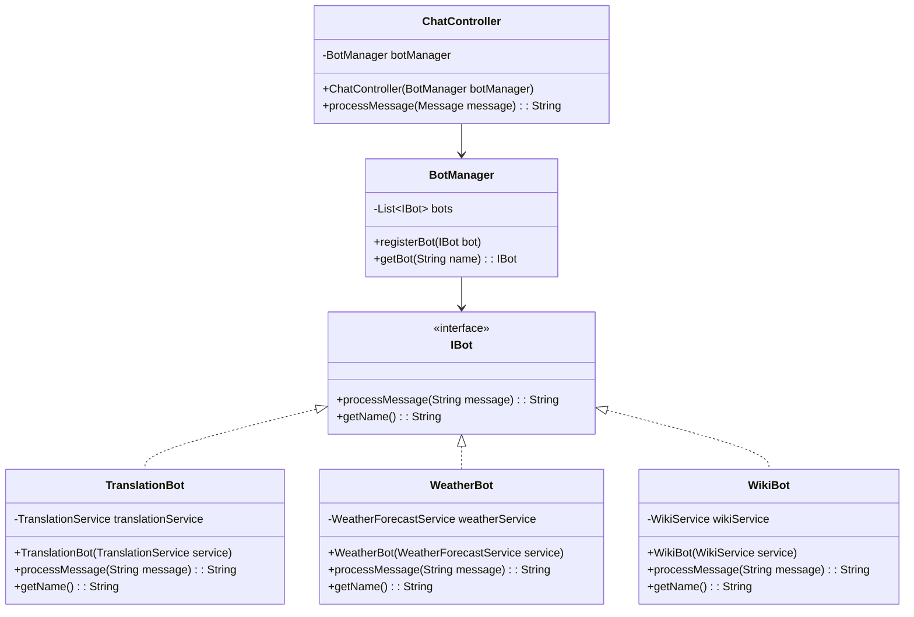
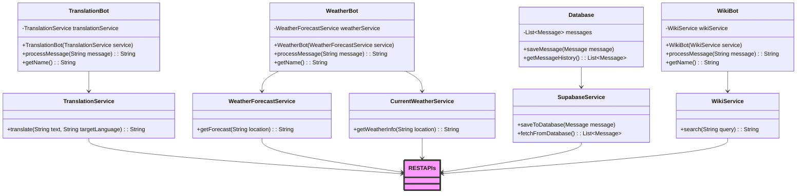
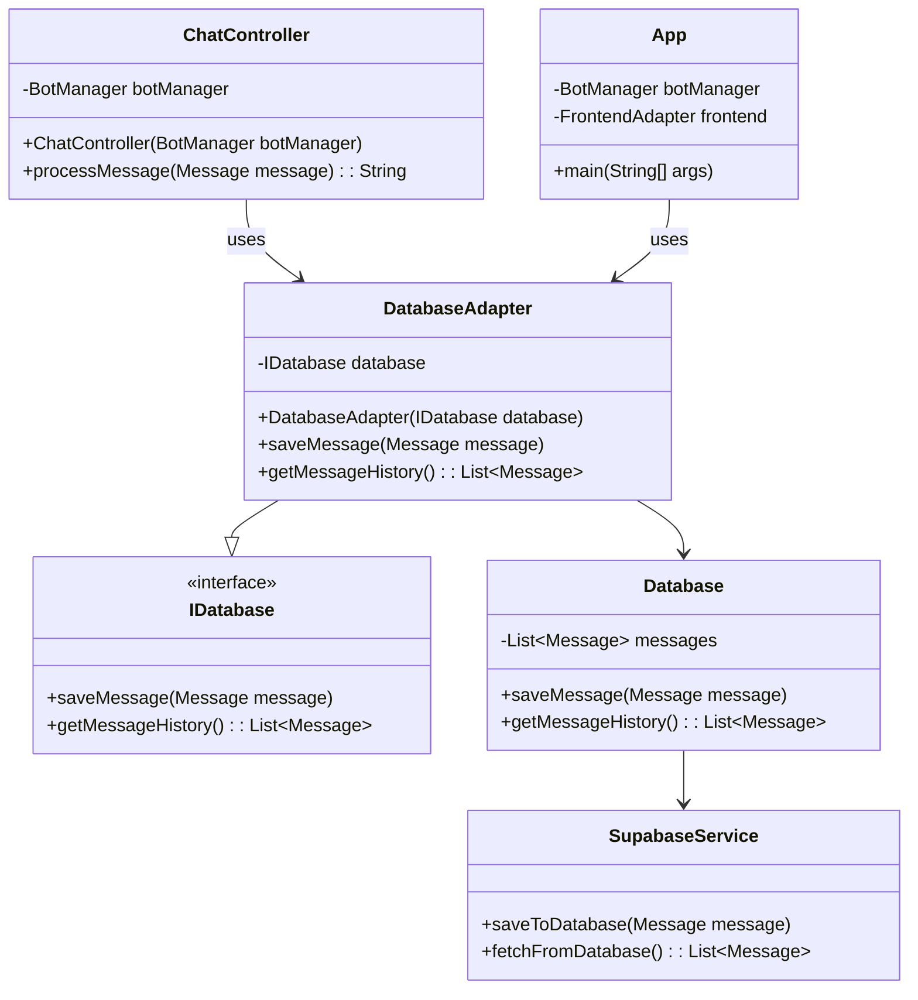
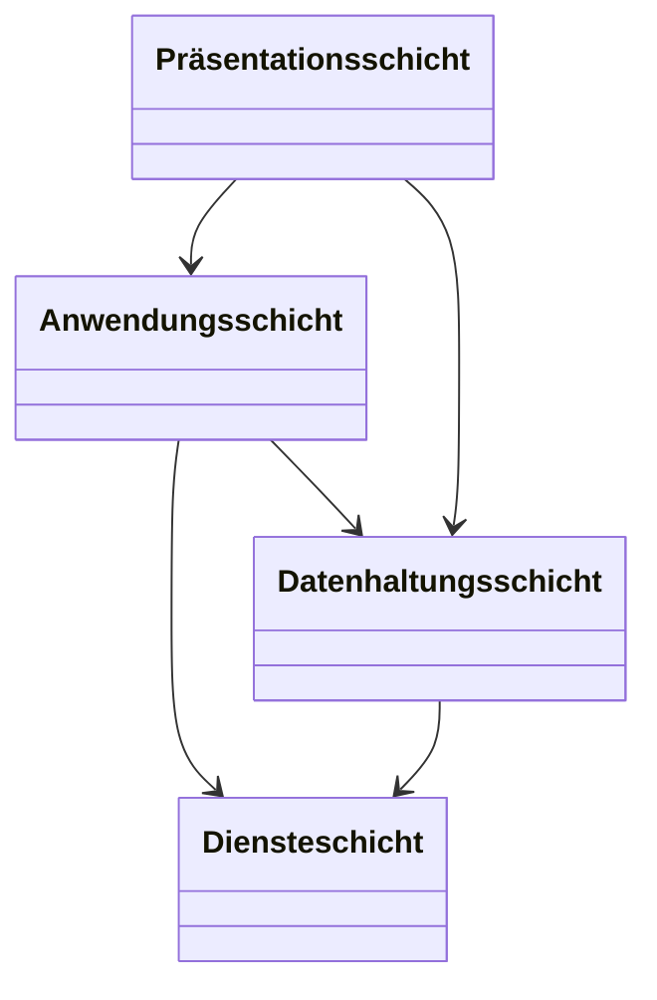
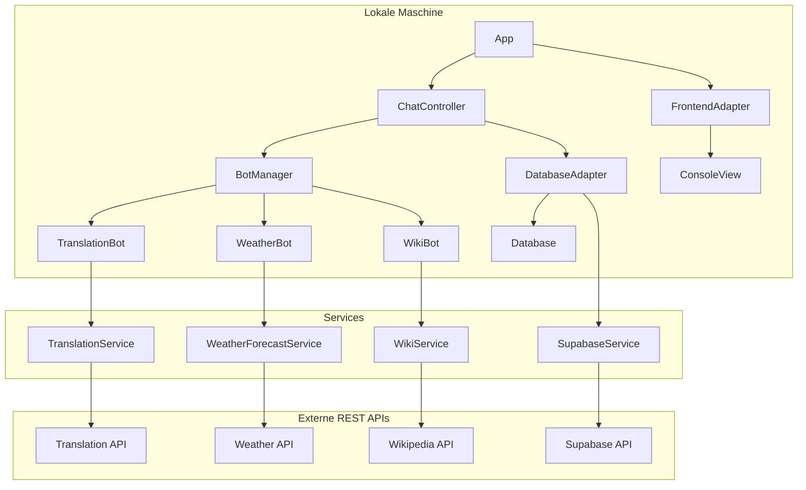

# 1.9 Infrastruktursicht
## Technische Infrastruktur

Unser Chatbot-System ist als lokale Anwendung konzipiert, die auf einem einzelnen Computer läuft. Die technische Infrastruktur ist daher relativ einfach und fokussiert sich auf die Interaktion mit externen Diensten über REST APIs.

Lokale Anwendung: Die Hauptanwendung, bestehend aus den Java-Programmen und -Bibliotheken (einschließlich json-20240303.jar, kotlin-stdlib-2.0.20.jar, okhttp-4.9.3.jar, und okio-2.10.0.jar), wird lokal auf einem einzelnen Rechner ausgeführt.

## Erweiterte Systemtopologie

### Präsentationsschicht (Frontend Layer)

#### Zweck: 
Diese Schicht ist verantwortlich für die Interaktion mit dem Benutzer und die Darstellung der Ausgabe.
#### Hauptkomponenten:
###### App.java: 
Startpunkt des Programms, der die Anwendung initialisiert und den Ablauf steuert.
######  FrontendAdapter.java: 
Vermittelt zwischen der Logik und der tatsächlichen Benutzeroberfläche.
###### ConsoleView.java: 
Konkrete Implementierung des Frontends, die Benutzereingaben entgegennimmt und Ausgaben anzeigt.
###### IFrontend.java: 
Interface, das die Methoden definiert, die jede Benutzeroberfläche implementieren muss.

### Anwendungsschicht (Application/Business Logic Layer)

#### Zweck: 
Diese Schicht enthält die Geschäftslogik des Systems und steuert die Interaktionen zwischen verschiedenen Komponenten.
#### Hauptkomponenten:
##### Bots:
###### IBot.java: 
Interface, das die grundlegende Funktionalität eines Bots definiert.
###### TranslationBot.java, WeatherBot.java, WikiBot.java: 
Implementierungen von verschiedenen Chatbots, die spezifische Services nutzen.
##### Controller:
###### ChatController.java: 
Verantwortlich für die Verarbeitung von Nachrichten und das Weiterleiten an den entsprechenden Bot.
##### Manager:
###### BotManager.java:
Verwalten der Registrierung und Auswahl von Chatbots.

### Diensteschicht (Service Layer)

#### Zweck:
Diese Schicht ist verantwortlich für die Kommunikation mit externen Diensten und APIs.
#### Hauptkomponenten:
###### TranslationService.java: 
Schnittstelle zu einem Übersetzungsdienst (REST API).
###### WeatherForecastService.java:
Schnittstelle zu einem Wettervorhersagedienst für Wetter in der Zukunft(REST API).
###### CurrentWeatherService.java: 
Schnittstelle zu einem Wettervorhersagedienst für das Aktuelle Wetter(REST API).
###### WikiService.java: 
Schnittstelle zu einem Wikipedia-API.
###### SupabaseService.java: 
Spezifischer Service für den Datenbankzugriff über die Supabase-API.

### Datenhaltungsschicht (Data Access Layer)

#### Zweck: Diese Schicht kümmert sich um die Persistenz von Daten und den Zugriff auf die Datenbank.
#### Hauptkomponenten:
###### IDatabase.java: 
Interface, das die grundlegenden Datenbankoperationen definiert.
###### Database.java: 
Konkrete Implementierung der Datenbanklogik, hält die Nachrichten in einer lokalen Liste.
###### DatabaseAdapter.java: 
Vermittelt zwischen der Anwendung und der konkreten Datenbankimplementierung (z. B. Supabase).
###### SupabaseService.java: 
Service, der eine Verbindung zur Supabase-Datenbank herstellt.

Die Schichten Agieren wie folgt miteinander:

